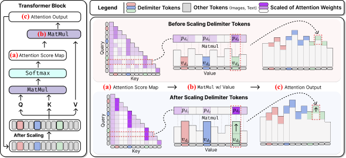
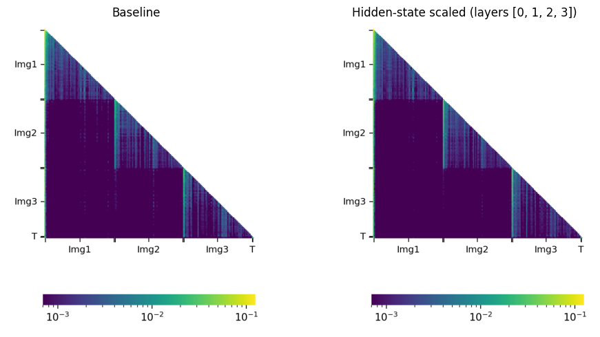

# Reproduction: full MuirBench headline claim

Tested Table-1 Qwen2.5-VL-3B MuirBench delimiter scaling on the full public 2,600-example test set. **Partially reproduced:** paper 37.31% → 42.42% (+5.11 pp); local 37.00% → 41.19% (+4.19 pp). The run used 2× local RTX PRO 6000 Blackwell GPUs, Python 3.10/PyTorch CUDA 12.8, SDPA vision+language with blockwise vision attention, rather than the README's four-process FlashAttention2/sampled path. λ=8/layers 0–3 is the released-code reference setting; the paper's 10%-test tuning protocol was not reproduced. Details: [full report](reports/delimiter-token-scaling-muirbench/reproduction-report.md).

Independent integrity check: scaled samples contain all 2,600 unique document IDs (0–2599), with 1,071 exact correct; paired outcomes are 277 improved / 168 regressed, net +109.

| Branch / experiment | Purpose or change | Exact run command | Verdict / outcome | Compute |
|---|---|---|---|---|
| `main` | Not run as an experiment (publication surface) | — | Published reproduction materials | — |
| [full baseline](https://github.com/mrpc2003/DelimScaling/tree/orx/memory-safe-blockwise-vision-sdpa-baseline) | SDPA/blockwise full baseline | `bash reproduction/run_muirbench.sh` | 37.00% (962/2600) | local 2× RTX PRO 6000 Blackwell |
| [scaled reference](https://github.com/mrpc2003/DelimScaling/tree/orx/released-code-delimiter-scaling-lambda-8-layers) | Enable λ=8, layers 0–3 | `bash reproduction/run_muirbench.sh` | 41.19% (1071/2600), +4.19 pp | local 2× RTX PRO 6000 Blackwell |

# Enhancing Multi-Image Understanding Through Delimiter Token Scaling (ICLR 2026)


by [Minyoung Lee](https://sites.google.com/view/minyoung-lee), [Yeji Park](https://yejipark-m.github.io/), [Dongjun Hwang](https://dongjunhwang.github.io/), [Yejin Kim](https://sites.google.com/view/yejin-c-kim/), [Seong Joon Oh](https://coallaoh.github.io/), [Junsuk Choe](https://sites.google.com/site/junsukchoe/)

This repository contains the code for the paper **["Enhancing Multi-Image Understanding Through Delimiter Token Scaling"](https://openreview.net/forum?id=7QFf05KrOm)** presented at ICLR 2026.


> **Abstract**: Large Vision-Language Models (LVLMs) achieve strong performance on single-image tasks, but their performance declines when multiple images are provided as input. One major reason is the cross-image information leakage, where the model struggles to distinguish information across different images. Existing LVLMs already employ delimiter tokens to mark the start and end of each image, yet our analysis reveals that these tokens fail to effectively block cross-image information leakage. To enhance their effectiveness, we propose a method that scales the hidden states of delimiter tokens. This enhances the model’s ability to preserve image-specific information by reinforcing intra-image interaction and limiting undesired cross-image interactions. Consequently, the model is better able to distinguish between images and reason over them more accurately. Experiments show performance gains on multi-image benchmarks such as Mantis, MuirBench, MIRB and QBench2. We further evaluate our method on text-only tasks that require clear distinction. The method improves performance on multi-document and multi-table understanding benchmarks, including TQABench, MultiNews and WCEP-10. Notably, our method requires no additional training or inference cost.



## TODO / Code Release Plan

We are in the process of cleaning up and preparing the codebase for public release.
The following components will be released progressively:

- [X] **Multi-image understanding evaluation code**  
  (Delimiter token scaling integrated into LVLM inference and evaluation pipelines)

- [X] **LLM benchmark code**  
  (Multi-document and multi-table benchmarks including TQABench, MultiNews, and WCEP-10)

- [X] **Visualization code**  
  (Attention maps and interaction analysis for delimiter tokens)

The full code will be released upon final preparation.


## Installation

### Pull the docker image

```bash
docker pull myelena/delim_scaling:slim
```
### Install dependencies

Inside the container:

```bash
git clone https://github.com/MYMY-young/DelimScaling.git
cd DelimScaling

cd transformers
pip install -e .

cd ../qwen-vl-utils
pip install -e .

pip install flash-attn==2.7.4.post1
```

### Running Evaluation

```bash
accelerate launch --num_processes 4 --main_process_port 12345 -m lmms_eval \
    --model qwen2_5_vl \
    --model_args pretrained=Qwen/Qwen2.5-VL-3B-Instruct,device_map=cuda,attn_implementation=flash_attention_2 \
    --tasks mantis \
    --batch_size 1 \
    --delim_scaling True \
    --scale 8 \
    --select_layer 0,1,2,3
```

### Key Arguments

- `--model_args pretrained=...` : Specify the pretrained model to use. This can be either a local path or a HuggingFace model identifier. For example, `Qwen/Qwen2.5-VL-3B-Instruct`.
- `--tasks` : Specify the evaluation tasks. 
- `--delim_scaling` : Enable delimiter token scaling.  
- `--scale` : Scaling factor.
- `--select_layer` : Layers where scaling is applied.

## Supported Tasks

Multi-Image Understanding benchmarks:

- **[Mantis](https://huggingface.co/datasets/TIGER-Lab/Mantis-Eval)**
- **[Muirbench](https://huggingface.co/datasets/MUIRBENCH/MUIRBENCH)**
- **[MIRB](https://huggingface.co/datasets/VLLMs/MIRB)**
- **[QBench2](https://huggingface.co/datasets/q-future/Q-Bench2-HF/viewer/default/dev)**
## Supported Models

For Multi-Image Understanding:

- **[Qwen2.5-VL](https://huggingface.co/Qwen/Qwen2.5-VL-7B-Instruct)**
- **[InternVL3](https://huggingface.co/OpenGVLab/InternVL3-1B-hf)**
- **[LLaVA-OneVision](https://huggingface.co/llava-hf/llava-onevision-qwen2-7b-ov-hf)**

## Visualization

We provide a script to visualize attention maps and inspect the effect of delimiter token scaling directly, comparing baseline vs. scaled attention across image segments.



```bash
cd visualize
python3 attention_visualize.py \
    --dataset mirb --sample-idx 257 --layer 35 \
    --select-layer 0,1,2,3 --scale 8 --res-patches 512
```

### Key Arguments

- `--dataset` : Evaluation dataset to draw the sample from (`mantis` or `mirb`).
- `--sample-idx` : Dataset row index to visualize.
- `--layer` : Which transformer layer's attention to visualize (0-indexed).
- `--select-layer` : Comma-separated layer indices where delimiter token scaling is applied.
- `--scale` : Delimiter token scaling factor.
- `--res-patches` : Image resolution cap, in units of 28x28 patches.

Outputs (baseline / scaled attention maps and side-by-side comparisons) are saved to `attn_maps/` by default (`--out-dir` to change).

## Acknowledgments
Our code is based on [lmms-eval](https://github.com/EvolvingLMMs-Lab/lmms-eval) and [Transformer](https://github.com/huggingface/transformers).
If you use our work, please consider citing the above works as well.

## Citation

If you find this work useful for your research, please consider citing:

```bib
@inproceedings{lee2026delimscale,
  title={Enhancing Multi-Image Understanding through Delimiter Token Scaling},
  author={Lee, Minyoung and Park, Yeji and Hwang, Dongjun and Kim, Yejin and Oh, Seong Joon and Choe, Junsuk},
  booktitle={Proceedings of the 14th International Conference on Learning Representations},
  year={2026}
}
```
